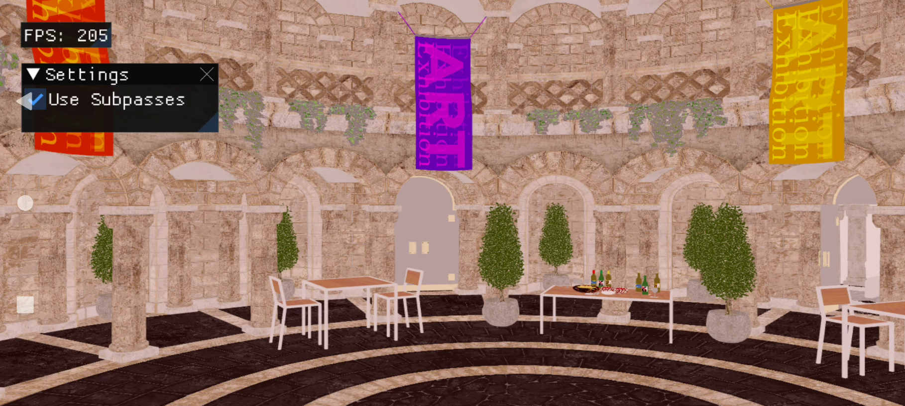
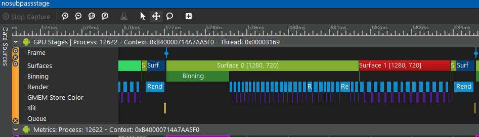
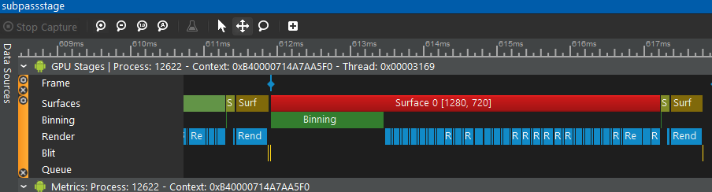
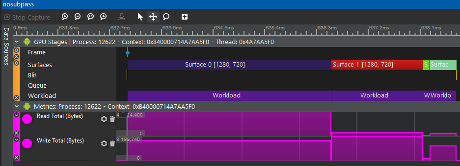
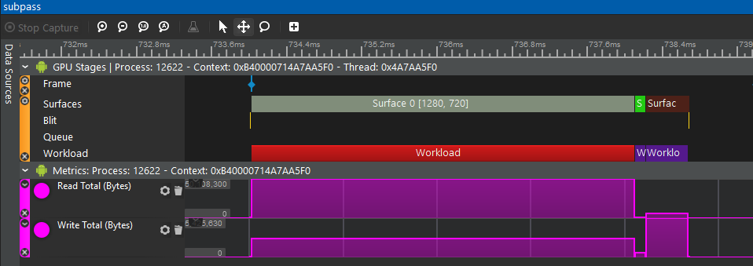

# SubPass Sample



## Overview

For mobile tile-based GPUs, subpasses is one of the most important ways to save memory bandwidth, therefore, to improve power efficiency and help performance at the meantime. 

SubPass sample demos the use of vulkan subpasses to perform a filmic tonemapping operator (on a simple forward rendered scene) and the impact on bandwidth and performance with subpass.
Optionally runs the tonemap as a subpass of the main scene pass.  Has onscreen UI controls to  enable/disable the use of subpasses (for measuring GPU subpass efficiency).
Bandwidth savings are meaused with Snapdragon Profiler. 60% of the bandwidth can be saved in this sample when enabling subpass.

From SnapdragonProfiler, we can see that there are four surfaces when subpass is disabled and three surfaces otherwise. There is extra GMEM stores when there is no subpass. 





Read total and write total have both been reduced when subpass is enable.





## Building

### Dependencies

The following dependencies must be installed and the appropriate locations should be referenced in the `PATH` environment variable.

* Android SDK
* Andorid NDK
* Gradle
* CMake
* Android Studio

### Pre-Build

Compile the underlying shaders to .spv by running the batch file below:

```
01_CompileShaders.bat
```

Note: The sample assumes the existence of supporting assets under the **'Media'** folder. These assets are not currently distributed with the framework.
The framework team is working to build a centralized asset repository that should minimize these requirements in the near future.

### Build

Once the dependencies are installed and shaders compiled, building this sample .apk/.exe is as simple as running any of the batch files from the framework root directory, accordingly to your target system:

```
01_BuildAndroid.bat
02_BuildWindows.bat
```

### Deploy (android-only)

To deploy the media files and the .apk to a connected device, run the batch files below:

```
02_Install_APK.bat
```

If desired, you can keep track of any logging by running one of the logcat batch files (which you can find on the current directory).

## Android Studio

This sample can also be easily imported to Android Studio and be used within the Android Studio ecosystem including building, deploying, and native code debugging.

To do this, open Android Studio and go to `File->New->Import Project...` and select the `project\android` folder as the source for the import. This will load up the gradle configuration and once finalized, the sample can be used within Android Studio.
