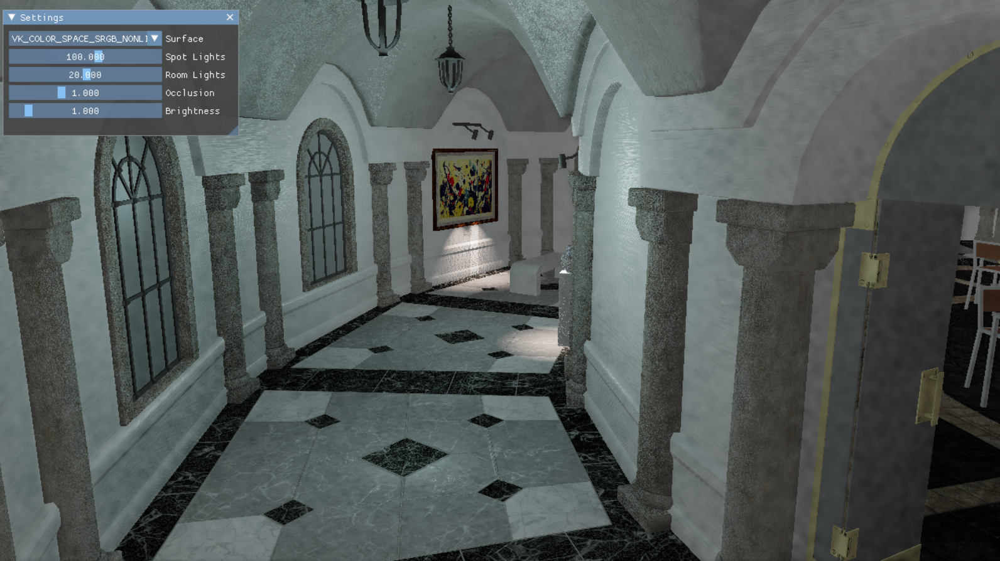
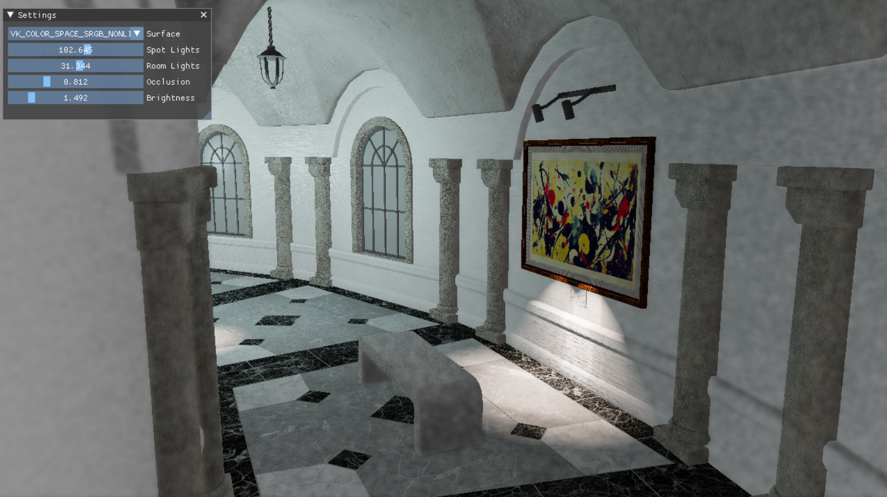

# HDRSwapchain Sample





## Overview

HDRSwapchain demonstrates the use of different swapchain image formats and colorspaces.  Has a gui dropdown that allows for switching buffer formats on the fly.
Also demonstrates Qualcomm Vulkan render-pass transform extension VK_QCOM_render_pass_transform.

## Building

### Dependencies

The following dependencies must be installed and the appropriate locations should be referenced in the `PATH` environment variable.

* Android SDK
* Andorid NDK
* Gradle
* CMake
* Android Studio

### Pre-Build

Compile the underlying shaders to .spv by running the batch file below:

```
01_CompileShaders.bat
```

And convert the needed textures and shaders to the correct format using the batch file below:

```
02_PrepareMedia.bat
```

Note: The sample assumes the existence of supporting assets under the **'Media'** folder. These assets are not currently distributed with the framework.
The framework team is working to build a centralized asset repository that should minimize these requirements in the near future.

### Build

Once the dependencies are installed and shaders compiled, building this sample .apk/.exe is as simple as running any of the batch files from the framework root directory, accordingly to your target system:

```
01_BuildAndroid.bat
02_BuildWindows.bat
```

### Deploy (android-only)

To deploy the media files and the .apk to a connected device, run the batch files below:

```
02_Install_APK.bat
```

If desired, you can keep track of any logging by running one of the logcat batch files (which you can find on the current directory).

## Android Studio

This sample can also be easily imported to Android Studio and be used within the Android Studio ecosystem including building, deploying, and native code debugging.

To do this, open Android Studio and go to `File->New->Import Project...` and select the `project\android` folder as the source for the import. This will load up the gradle configuration and once finalized, the sample can be used within Android Studio.
