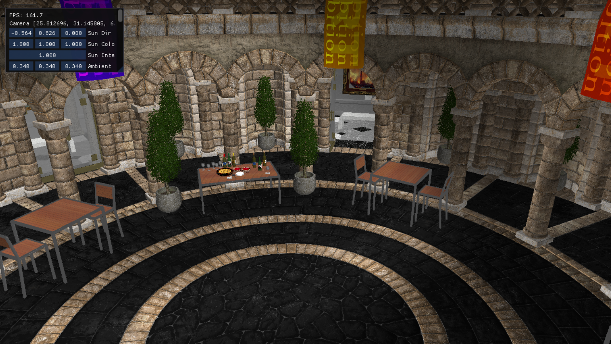

# Hello-GLTF Sample



## Overview

Hello GLTF sample demonstrates the most basic usage of the Framework to produce a native Vulkan application and it is designed to be small and simple and meant as a starting point for developers to expand its functionality.

It is recommended that this sample is used as a starting point for other applications using this Framework. To do so, this folder can be copied to a desired location and the respective changes to point the source and include files to the Framework `src` and `include` folders are addressed. For simplicity, the folder of the new sample can be created alongside the `hello-gltf` sample within the `samples` folder. This way, no additional modifications are required in any configuration file to build it out of the box.

## Building

### Dependencies

The following dependencies must be installed and the appropriate locations should be referenced in the `PATH` environment variable.

* Android SDK
* Andorid NDK
* Gradle
* CMake
* Android Studio

### Pre-Build

Compile the underlying shaders to .spv by running the batch file below:

```
01_CompileShaders.bat
```

And convert the needed textures and shaders to the correct format using the batch file below:

```
02_PrepareMedia.bat
```

Note: The sample assumes there are user provided asset files at the following path: **'Media\Meshes\Museum.gltf'** and **'Media\Meshes\Museum.bin'**.
Texture dependencies from this asset should be added to **'Media\Textures\'** and are required to have the *.ktx* extension.
There are 3 extra require supporting textures that should also go to the same texture path listed above: **white_d.ktx**, **black_d.ktx** and **normal_default.ktx**.
The framework team is working to build a centralized asset repository that should minimize these requirements in the near future.

### Build

Once the dependencies are installed and shaders compiled, building this sample .apk/.exe is as simple as running any of the batch files from the framework root directory, accordingly to your target system:

```
01_BuildAndroid.bat
02_BuildWindows.bat
```

### Deploy (android-only)

To deploy the media files and the .apk to a connected device, run the batch files below:

```
02_CopyMediaToDevice.bat
03_Install_APK.bat
```

If desired, you can keep track of any logging by running one of the logcat batch files (which you can find on the current directory).

## Android Studio

This sample can also be easily imported to Android Studio and be used within the Android Studio ecosystem including building, deploying, and native code debugging.

To do this, open Android Studio and go to `File->New->Import Project...` and select the `project\android` folder as the source for the import. This will load up the gradle configuration and once finalized, the sample can be used within Android Studio.
