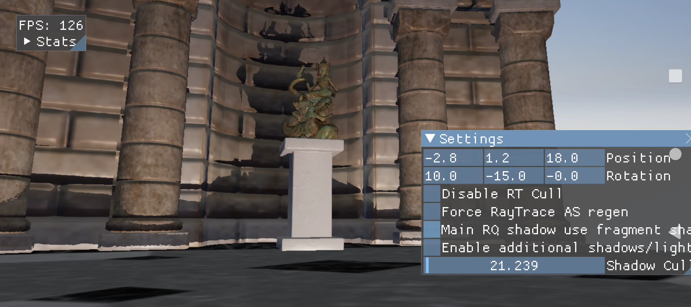

# Ray Query Shadows sample



## Overview

Uses the Vulkan Ray Tracing extensions to implement shadows from a point light source in a non-trivial scene.

Requires drivers with the 'final' Vulkan Ray Tracing api (Dec 2020 onwards).

## Building

### Dependencies

The following dependencies must be installed and the appropriate locations should be referenced in the `PATH` environment variable.

* Android SDK
* Andorid NDK
* Gradle
* CMake
* Android Studio

### Pre-Build

Compile the underlying shaders to .spv by running the batch file below:

```
01_CompileShaders.bat
```


Note: The sample assumes the existence of supporting assets under the **'Media'** folder. These assets are not currently distributed with the framework.


### Build

Once the dependencies are installed and shaders compiled, building this sample .apk/.exe is as simple as running any of the batch files from the framework root directory, accordingly to your target system:

```
01_BuildAndroid.bat
02_BuildWindows.bat
```

### Deploy (android-only)

To deploy the media files and the .apk to a connected device, run the batch files below:

```
02_Install_APK.bat
```

## Android Studio

This sample can also be easily imported to Android Studio and be used within the Android Studio ecosystem including building, deploying, and native code debugging.

To do this, open Android Studio and go to `File->New->Import Project...` and select the `project\android` folder as the source for the import. This will load up the gradle configuration and once finalized, the sample can be used within Android Studio.


## Running

Windows:
- From this directory (samples\rayQueryShadows) execute `..\..\project\windows\solution\samples\rayQueryShadows\Debug\rayQueryShadows.exe`
- (you can also compile/run by opening `project\windows\solution\vkSampleFramework.sln` in Visual Studio and running rayQueryShadows)

Android:
- This sample runs on hardware that exposes the Vulkan Acceleration Structure and Ray Query extensions

## Configuration

The sample will run with reasonable defaults but the user can override settings by placing a `app_config.txt` text file in the sample root folder (eg samples\rayQueryShadows\app_config.txt)

This file can also be pushed to Android device (takes precidence of the app_config.txt in the apk install):
<pre>
adb push ./app_config.txt /sdcard/Android/data/com.quic.rayqueryshadows/files/app_config.txt
</pre>

Example contents:
<pre><code>gRenderHud = true
gCameraStartPos = { -1012, 1047, 568 }
gCameraStartRot = { 77.0, 49.0, 73.0 }
gShadowLightPos = { 111.0, 420.0, -423.0 }
gShadowLightTarget = { 269.0, 0.0, -254.0 }
gShadowPosition = {-208.0, 422.6, 464.9 }


gSurfaceWidth = 1280
gSurfaceHeight = 720

gRenderWidth = 1280
gRenderHeight = 720

gEnableValidation = true

</code></pre>

Additional options:
- gCreateCulledAccelerationStructure=false (default true).

  Disables the acceletration structure culling and instead creates the acceleration structures with all BLAS instances (entire scene).

- gFragmentShaderRTShadows (default false)

   Enable lights/shadows run in additional fragment shader passes (renders a sphere for each 'additional' light and raytraces shadows for all gbuffer pixels touched by the light)

- gEnableValidation (default true)

  Enable Khronos Vulkan validation layer, disable to reduce CPU load (samples should aim to be free of Validation errors)

- gRenderShadow (default true)

  Disable rendering of shadows (ie disable ray queries).  Screen will be rendered as if everything is in shadow!

- gFixedFrameRate (default 0)

  Set a fixed frame rate for the application.  CPU sleep() will be added every frame so on average the application hits the target (assuming it is lower than the maximum achievable on the target device).  Frame time reported to the application's Update is fixed (derived from gFixedFrameRate).  Value of 0 disables this feature and runs the application at its maximum speed.

- gFifoPresentMode (default false)

  When set to true changes Vulkan's swapchain present mode to 'VK_PRESENT_MODE_FIFO_KHR'.  Will fix the application's maximum present frequency (and thus application fps) to that of the display.

- gRayQueryFragmentShader (default false)

  When set to true runs the fullscreen ray queried shadow pass in a fullscreen fragment shader (vs compute when false)