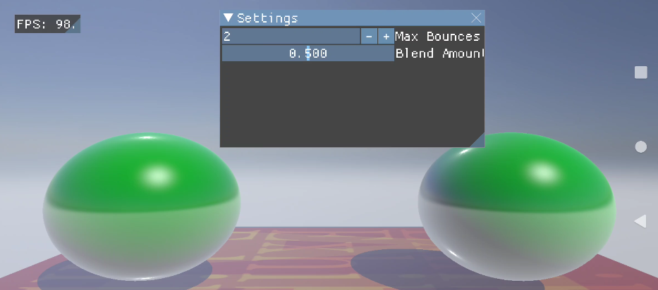

# Ray Reflections sample



## Overview

Vulkan Ray Tracing: Reflections

## Building

### Dependencies

The following dependencies must be installed and the appropriate locations should be referenced in the `PATH` environment variable.

* Android SDK
* Andorid NDK
* Gradle
* CMake
* Android Studio

### Pre-Build

Compile the underlying shaders to .spv by running the batch file below:

```
01_CompileShaders.bat
```


Note: The sample assumes there are user provided asset files at the following path: **'Media\Meshes\Museum.gltf'** and **'Media\Meshes\Museum.bin'**.
Texture dependencies from this asset should be added to **'Media\Textures\'** and are required to have the *.ktx* extension.
There are 3 extra require supporting textures that should also go to the same texture path listed above: **white_d.ktx**, **black_d.ktx** and **normal_default.ktx**.
The framework team is working to build a centralized asset repository that should minimize these requirements in the near future.

### Build

Once the dependencies are installed and shaders compiled, building this sample .apk/.exe is as simple as running any of the batch files from the framework root directory, accordingly to your target system:

```
01_BuildAndroid.bat
02_BuildWindows.bat
```

### Deploy (android-only)

To deploy the media files and the .apk to a connected device, run the batch files below:

```
02_Install_APK.bat
```

If desired, you can keep track of any logging by running one of the logcat batch files (which you can find on the current directory).

## Android Studio

This sample can also be easily imported to Android Studio and be used within the Android Studio ecosystem including building, deploying, and native code debugging.

To do this, open Android Studio and go to `File->New->Import Project...` and select the `project\android` folder as the source for the import. This will load up the gradle configuration and once finalized, the sample can be used within Android Studio.


## Running

Windows:
- From this directory (samples\rayReflections) execute `..\..\project\windows\solution\samples\rayReflections\Debug\rayReflections.exe`
- (you can also compile/run by opening `project\windows\solution\vkSampleFramework.sln` in Visual Studio and pointing the debug 'Working Directory' to samples\rayReflections)

Android:
- This sample runs on hardware that exposes the Vulkan Acceleration Structure and Ray Query extensions

## Configuration

The sample will run with reasonable defaults but the user can override settings by placing a `app_config.txt` text file in the sample root folder (eg samples\rayReflections\app_config.txt)
