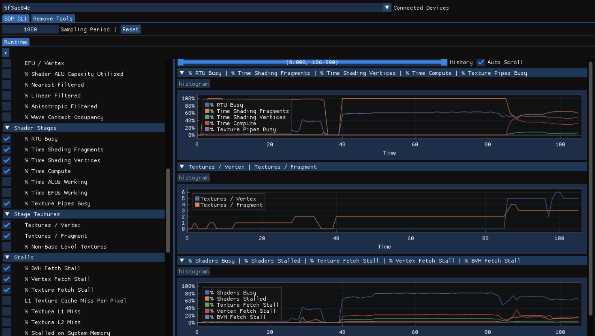

# SDP CLI Sample



## Overview

SDP CLI (sdpcli) is a command line, on-device profiling tool for devices with Adreno™ GPUs. The tool provides some of the most often used [Snapdragon® Profiler](https://www.qualcomm.com/developer/software/snapdragon-profiler) functionality as a CLI application, that can easily be integrated into any project. SDP CLI is available at [Qualcomm® Software Center](https://softwarecenter.qualcomm.com/#/catalog/item/b71f3c61-9efe-11ee-ba71-026b10d3716b?type=Tool).

This sample uses the CLI application to fetch device counters through the *realtime* metrics mode. It uses ImGui to create an UI where one can visualize the fetched data with graphs over long periods of time.

Some implementation details of this sample:
- Drag and drop a graph into another to merge
- Right click a graph entry on the legend to unmerge
- Device selection is available through a drop-down widget
- Sampling period can be adjusted
- Each graph can be viewed as a histogram if not in a group

## Building

### Build

Building this sample *.exe* is as simple as running any of the batch files from the framework root directory, accordingly to your target system:

```
02_BuildWindows.bat
```

## Running

After running the sample *.exe*, you will be asked for the *sdpcli* executable and the *trace* apk corresponding to your device (grab these at [Qualcomm® Software Center](https://softwarecenter.qualcomm.com/#/catalog/item/b71f3c61-9efe-11ee-ba71-026b10d3716b?type=Tool)). 
After both are selected, press *inject* (sample will copy/install these 2 files into your device) and you should be directed to the sample main UI.